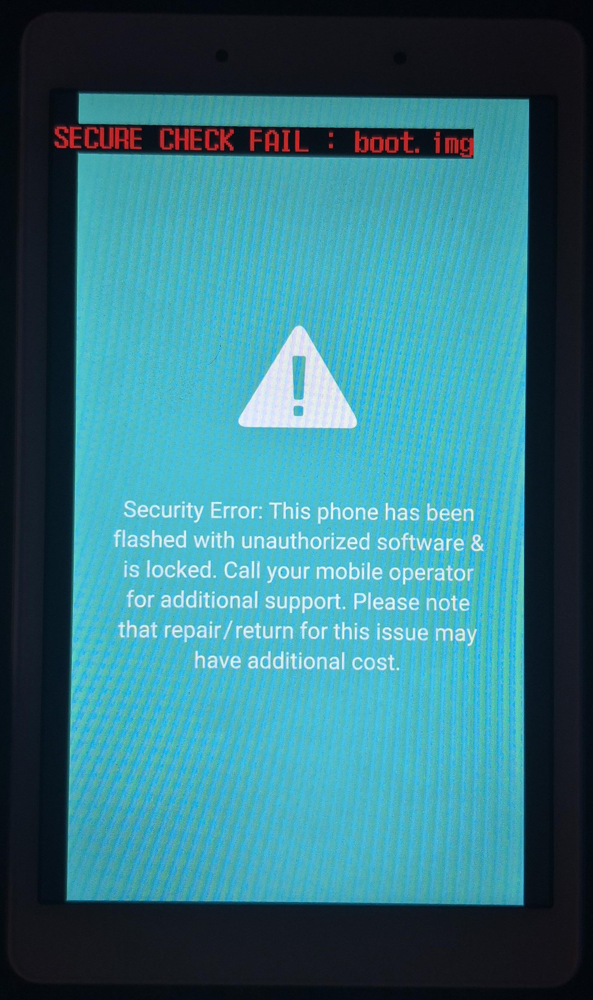

## Background
The T290's bootloader has a bug where it refuses to load boot/recovery images that don't contain the `SignerVer02` magic and an AVB Footer at the end of the partition with the image's size. This results in the "SECURE CHECK FAIL" screen that we all know and love.

?
    

## How to fix?
You have two options:
* Flash the [FixBootImage zip](https://github.com/GalaxyA20s/A20s-Fix-Bootable-Image/releases/latest/download/FixBootImage.zip) in TWRP. This will fix the boot image you have installed on your device.
* Use the [Python script](./fix_bootable_image.py) to fix the image & then flash it. Example: `python fix_bootable_image.py boot.img fixed.img`
